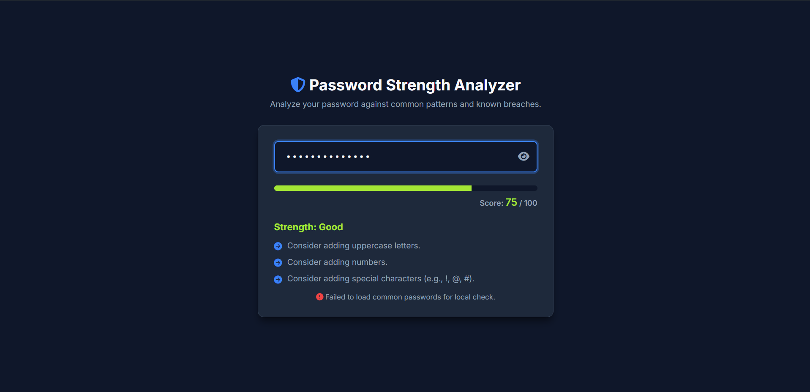

# Password Strength Analyzer [CYBERSECURITY]

## Description
This is a modern, real-time Password Strength Analyzer built for the **Day 49 Cybersecurity Challenge**.

It checks password strength by analyzing:
1. **Length & Character Mix** (Uppercase, lowercase, numbers, special characters).
2. **Common Passwords Check:** Instantly checks the password against a truncated list of 10,000 common passwords from `rockyou.txt`. If compromised, the score drops to 0.
3. **zxcvbn Integration:** Uses the Dropbox `zxcvbn` library for realistic strength estimation, pattern matching, and actionable feedback.

## Features
- Real-time strength calculation (0 to 100 Score).
- Dynamic Progress Bar (Red -> Yellow -> Green).
- Live suggestions and warnings.
- Password visibility toggle.
- Clean, dark-mode cyber aesthetic.

## Screenshot

## Usage
Simply open `index.html` in your browser and start typing! The background fetch will load the 10,000 common passwords automatically.

---
**Challenge Completed By:** @Infinite-L00pBaCk / @PriyamPrakash-25
